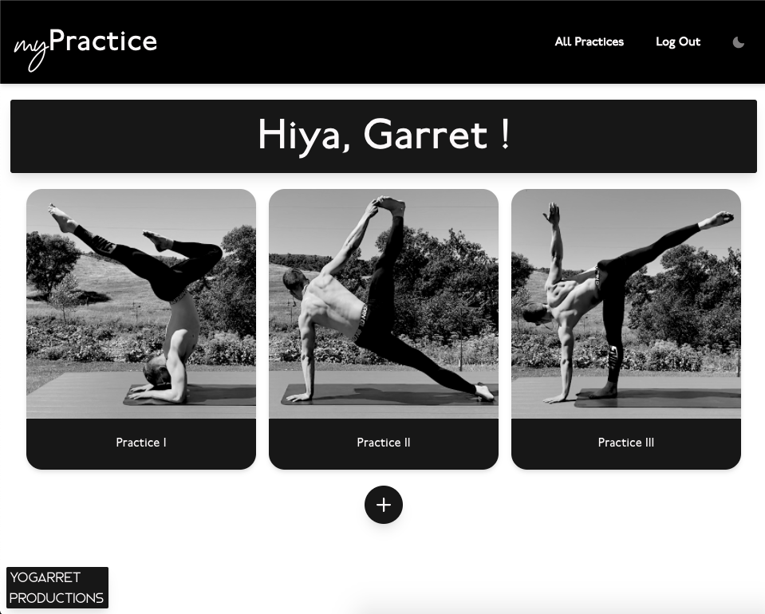
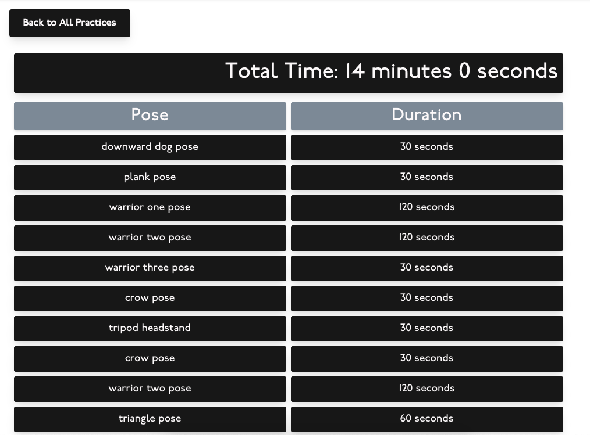

# myPractice

## Background

During college in 2014, I went to my first hot (bikram) yoga class. It was easily one of the hardest things I’ve done in terms of physical exertion (I thought it was almost as bad as when I ran a marathon!). By the end, my mat, my clothes, and my body were completely saturated with sweat. Besides the short-term pain during it, the post-workout-euphoric feeling I got from it has stuck with me. Since then, I’ve incorporated a hot yoga practice into my fitness routine.

One thing I find difficult with yoga is staying on track when it comes to holding the poses/stretches for long periods of time. I often lose focus and find myself switching poses when I am not even halfway through holding one pose. I also find myself constantly looking at the clock, calculating the time for the next pose, and then trying to remember what the next pose is. This often leads to me becoming frustrated and not even enjoying the practice.

myPractice is an application that solves the problem described above. Users can create customizable yoga practices where keeping track of poses is done for you with the help of a "virtual assistant."

Future features I am planning to implement include:

- Allow users to customize the virtual assistant by gender, accent, pitch, & vocal speed
- Incorporate yoga breathing techniques, inspired from the book "Breath" by James Nestor
- Integrate Apple Music/Spotify
- (1) Train a neural network to identify yoga poses done by a user, and (2) possibly give suggestions on improvement
- Make it mobile friendly

## Screen Shots

### Login Page

### All Practices Page

### Create Practice Page

### Practice Details Page

### Timer Page

## Technologies

- Postgres
- Node.js
- Express
- React
- Redux
- Chakra UI
- Howler.js
- Google Text-to-Speech API

## Installation

### Prerequisites

- [Node.js](https://nodejs.org/en/)
- A Google Cloud account with valid credentials to use Text-to-Speech API (usually a .json file you provide the file path for on your local or an API key). For a set of instruction to do this go here: [Getting Started with authentication][https://cloud.google.com/docs/authentication/getting-started]

### Steps

1. Create a database named `my_practice`,
2. The queries in the `database.sql` file are set up to create all the necessary tables and populate the needed data to allow the application to run correctly. The project is built on [Postgres](https://www.postgresql.org/download/), so you will need to make sure to have that installed.
3. Open up your editor of choice and run an `npm install`
4. Create .env file and place google credential in file (IE, type: GOOGLE_APPLICATION_CREDENTIAL="PATH_to_your_valid_key_here!"). Example of file path: "/Users/garret.larson/Desktop/text-to-speech-file.json"
5. Run `npm run server` in your terminal
6. Run `npm run client` in your terminal (the `npm run client` command should open up a new browser tab for you)

## Usage

1. Create an account or login.
2. Once logged in, you can view all of your yoga practices.
3. Clicking on any practice card will display the details of a given practice.
4. In the details view, Users can start, edit, or delete a specific practice by clicking the respective buttons and confirming actions.
5. After starting a practice, the timer begins with prompts for the next pose given by the virtual assistant. A meditation bell rings to signal the transition.
6. After finishing a practice, users are brought back to the main practices view.

## Acknowledgement

Thanks to Emerging Digital Academy for their guidance during development, and thanks to my family for their continued support.

## Support

If you have suggestions or issues, please email me at garret.hs.larson@gmail.com
